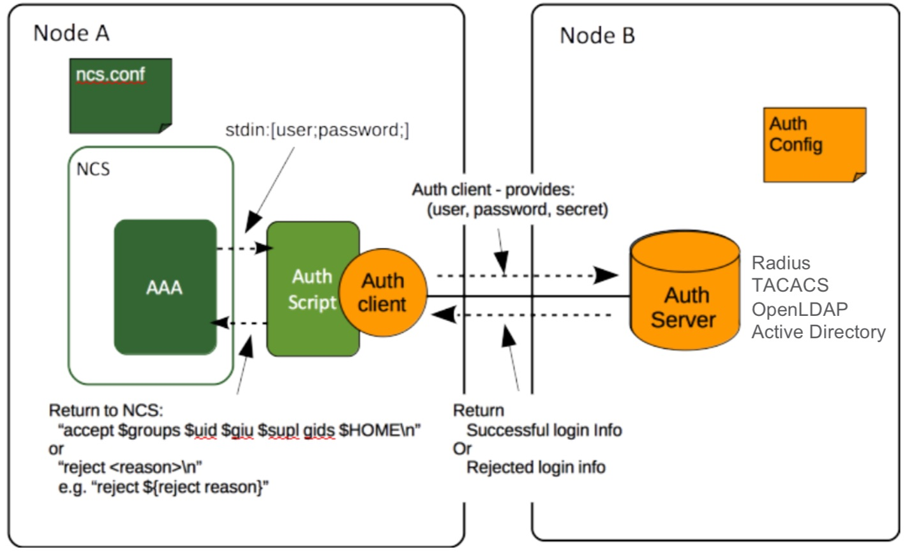

## NSO LDAP Authentication
The goal for this project is to leverage LDAP user authentication server for external authentication of NSO users.

### Background 
External Authentication for NSO is accomplished by creating some executable script that NSO calls when someeone tries
to login.  NSO simply passes user credentials to the script via standard input and expects an output statement in some
expected formats. What is done in the external authentication script is irrelevant to NSO, all that matters is the output.
For example, this script would work fine, but result in any provided credentials passing authentication and
being authorized for both admin and operator roles:

```python
#! /usr/bin/env python3 

accept = "accept admin oper 1004 1004 /tmp"
print(accept)
```

> For more details on how external authentication works, see the documentation at
`$NCS_DIR/doc/html/nso_admin_guide/ug.aaa.External_authentication.html` from your NSO installation.

#### External Authentication Script Input/Output
When user creates SSH or Netconf or Restconf session with NSO server, it invokes the external authentication executable
(in case of this package - Python script _ldap_auth.py_) and puts on the _stdin_ a message, which is then should be
received and processed by that executable. The format of the message is:
> [username;password]

The external authentication executable must put on the _stdout_ a message in one of these formats:
 - accept $groups $uid $gid $supplementary_gids $HOME
    * Issued when external authentication succeeded and NSO associated groups are determined. The parameters of the 
_accept_ statement are:
      * $groups - space separated list of the group names the user is a member of.
      * $uid - UNIX integer user id NSO should use as default when executing commands for this user.
      * $gid - UNIX integer group id NSO should use as default when executing commands for this user.
      * $supplementary_gids - (possibly empty) space separated list of additional UNIX group ids the user is also
 a member of.
 - reject $message
    * Issued when authentication with external server failed. When received, the NSO can try other available methods
 like PAM or local-authentication.
 - abort $message
    * Issued when authentication with external server failed and no other authentication methods are allowed.

#### NSO LDAP External Authentication Architecture


To interface with an external authentication entity, e.g. RADIUS or LDAP server,
the user needs to provide an authentication script/program that will interact with the specific authentication method.
The purpose of the script is not only soliciting the remote authentication server for user/password acceptance
but also determining groups that are associated with the user. On the LDAP server a _memberOf_ attribute must be added
to the database and groups with associated members must be created. This procedure in details described
[here](https://blog.adimian.com/2014/10/15/how-to-enable-memberof-using-openldap/).
These groups then returned from the script to NSO, prepended to any group information stored locally under the
_/aaa_ tree, and used by the NSO authorization process when checking _nacm_ rules.

#### Prerequisite

Need install Python package _python-ldap_:
```
pip install python-ldap
```

#### NSO Configuration

NSO base configuration in _ncs.conf_ must include an _<external-authentication>_ clause with the _<aaa>_
configuration to enable external authentication and provide the location of the authentication executable:
```
<aaa>
    <external-authentication>
        <enabled>true</enabled>
        <executable>./scripts/python/ldap-auth.py</executable>
    </external-authentication>
</aaa>
```

#### Test

```
bash$> ./ldap-auth.py
[yanlab;cisco123;]
accept "Administrators" "Sweden North" "Elvis is alive" 501 20 12 /tmp

bash$> ./ldap-auth.py
[bob;didntwin;]
reject ERROR:root:could not connect to AD server
```